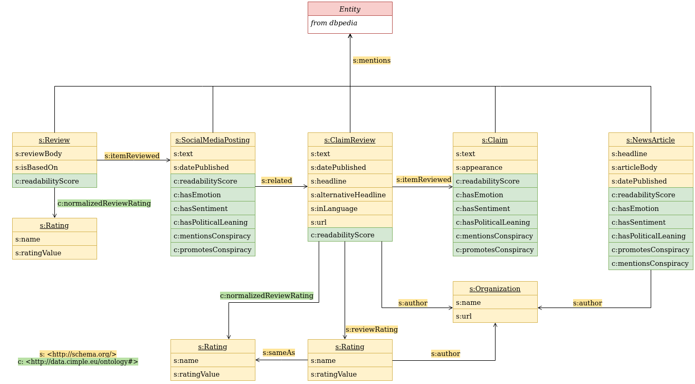

# 📚 CimpleKG data model and SPARQL queries
## 🗄️ Data model



The data model of the Cimple KG is represented in the [figure above](./CimpleKG_data_model.png).
In yellow are the classes and properties from the [Schema.org](https://schema.org/) vocabulary that we re-use.
In green are the properties that we define in this work. They are used to represent the factors and the normalized ratings. The Cimple ontology is described [here](https://github.com/CIMPLE-project/converter/blob/main/cimple-ontology.ttl).

## 🔍 Example SPARQL Queries


A SPARQL endpoint with a query console is available at [https://data.cimple.eu/sparql](https://data.cimple.eu/sparql). Results can be retrieved as JSON, XML, CSV, TSV, or RDF serializations. The links below execute each example against the endpoint and return CSV.
We share queries that showcase some use-case of Cimple KG that can serve as examples or template.

### [Most mentioned entities](https://data.cimple.eu/sparql?query=PREFIX%20schema%3A%3Chttp%3A%2F%2Fschema.org%2F%3E%0ASELECT%20%3Fent%20(COUNT(%3Fdoc)%20AS%20%3Fnum)%0AWHERE%20%7B%0A%20%20%20%20%3Fdoc%20schema%3Amentions%20%3Fent%20.%0A%7D%0AGROUP%20BY%20(%3Fent)%0AORDER%20BY%20DESC%20(%3Fnum)%0ALIMIT%20100&format=text%2Fcsv)
```SPARQL
PREFIX schema:<http://schema.org/>
SELECT ?ent (COUNT(?doc) AS ?num)
WHERE {
    ?doc schema:mentions ?ent .
}
GROUP BY (?ent)
ORDER BY DESC (?num)
LIMIT 100
```

### [Most mentioned entities with Donald Trump](https://data.cimple.eu/sparql?query=PREFIX%20schema%3A%3Chttp%3A%2F%2Fschema.org%2F%3E%0APREFIX%20dbr%3A%3Chttp%3A%2F%2Fdbpedia.org%2Fresource%2F%3E%0ASELECT%20%3Fent%20(COUNT(DISTINCT%20%3Fdoc)%20AS%20%3Fnum)%0AWHERE%20%7B%0A%20%20%20%20%3Fdoc%20schema%3Amentions%20%3Fent%20.%0A%20%20%20%20%3Fdoc%20schema%3Amentions%20dbr%3ADonald_Trump%20.%0A%20%20%20%20FILTER%20(%3Fent%20!%3D%20dbr%3ADonald_Trump)%0A%7D%0AGROUP%20BY%20(%3Fent)%0AORDER%20BY%20DESC%20(%3Fnum)%0ALIMIT%20100&format=text%2Fcsv)
```SPARQL
PREFIX schema:<http://schema.org/>
PREFIX dbr:<http://dbpedia.org/resource/>
SELECT ?ent (COUNT(DISTINCT ?doc) AS ?num)
WHERE {
    ?doc schema:mentions ?ent .
    ?doc schema:mentions dbr:Donald_Trump .
    FILTER (?ent != dbr:Donald_Trump)
}
GROUP BY (?ent)
ORDER BY DESC (?num)
LIMIT 100
```

### [Organisations that published the most fact-checks about Coronoavirus](https://data.cimple.eu/sparql?query=PREFIX%20schema%3A%3Chttp%3A%2F%2Fschema.org%2F%3E%0APREFIX%20dbr%3A%3Chttp%3A%2F%2Fdbpedia.org%2Fresource%2F%3E%0ASELECT%20%3ForgName%20%3ForgUrl%20(COUNT(DISTINCT%20%3Fcr)%20AS%20%3Fnum)%0AWHERE%20%7B%0A%20%20%20%20%3Fcr%20schema%3Aauthor%20%3Forg%20.%0A%20%20%20%20%3Fcr%20schema%3Amentions%20dbr%3ACoronavirus%20.%0A%20%20%20%20%3Forg%20schema%3Aname%20%3ForgName%20.%0A%20%20%20%20%3Forg%20schema%3Aurl%20%3ForgUrl%20.%0A%7D%0AGROUP%20BY%20%3ForgName%20%3ForgUrl%0AORDER%20BY%20DESC%20(%3Fnum)%0ALIMIT%20100&format=text%2Fcsv)
```SPARQL
PREFIX schema:<http://schema.org/>
PREFIX dbr:<http://dbpedia.org/resource/>
SELECT ?orgName ?orgUrl (COUNT(DISTINCT ?cr) AS ?num)
WHERE {
    ?cr schema:author ?org .
    ?cr schema:mentions dbr:Coronavirus .
    ?org schema:name ?orgName .
    ?org schema:url ?orgUrl .
}
GROUP BY ?orgName ?orgUrl
ORDER BY DESC (?num)
LIMIT 100
```

### [Number of distinct original review labels from fact-checkers that are mapped to a same normalized rating label](https://data.cimple.eu/sparql?query=PREFIX%20schema%3A%3Chttp%3A%2F%2Fschema.org%2F%3E%0APREFIX%20cimple%3A%3Chttp%3A%2F%2Fdata.cimple.eu%2Fontology%23%3E%0ASELECT%20%3FnormalizedRatingLabel%20(COUNT(DISTINCT%20%3Frating)%20AS%20%3Fnum)%0AWHERE%20%7B%0A%20%20%20%20%3Fcr%20a%20schema%3AClaimReview%20.%0A%20%20%20%20%3Fcr%20schema%3AreviewRating%20%3Frating%20.%0A%20%20%20%20%3Fcr%20cimple%3AnormalizedReviewRating%20%3FnormalizedRating%20.%0A%20%20%20%20%3FnormalizedRating%20schema%3Aname%20%3FnormalizedRatingLabel%20.%0A%7D%0AGROUP%20BY%20(%3FnormalizedRatingLabel)%0AORDER%20BY%20DESC%20(%3Fnum)&format=text%2Fcsv)
```SPARQL
PREFIX schema:<http://schema.org/>
PREFIX cimple:<http://data.cimple.eu/ontology#>
SELECT ?normalizedRatingLabel (COUNT(DISTINCT ?rating) AS ?num)
WHERE {
    ?cr a schema:ClaimReview .
    ?cr schema:reviewRating ?rating .
    ?cr cimple:normalizedReviewRating ?normalizedRating .
    ?normalizedRating schema:name ?normalizedRatingLabel .
}
GROUP BY (?normalizedRatingLabel)
ORDER BY DESC (?num)
```

### [Dates on which there was the most fact-checks about Ukraine](https://data.cimple.eu/sparql?query=PREFIX%20schema%3A%3Chttp%3A%2F%2Fschema.org%2F%3E%0APREFIX%20dbr%3A%3Chttp%3A%2F%2Fdbpedia.org%2Fresource%2F%3E%0ASELECT%20%3Fdate%20(COUNT(DISTINCT%20%3Fcr)%20AS%20%3Fnum)%0AWHERE%20%7B%0A%20%20%20%20%3Fcr%20a%20schema%3AClaimReview%20.%0A%20%20%20%20%3Fcr%20schema%3Amentions%20dbr%3AUkraine%20.%0A%20%20%20%20%3Fcr%20schema%3AdatePublished%20%3Fdate%20.%0A%7D%0AGROUP%20BY%20(%3Fdate)%0AORDER%20BY%20DESC%20(%3Fnum)%0ALIMIT%20100&format=text%2Fcsv)
```SPARQL
PREFIX schema:<http://schema.org/>
PREFIX dbr:<http://dbpedia.org/resource/>
SELECT ?date (COUNT(DISTINCT ?cr) AS ?num)
WHERE {
    ?cr a schema:ClaimReview .
    ?cr schema:mentions dbr:Ukraine .
    ?cr schema:datePublished ?date .
}
GROUP BY (?date)
ORDER BY DESC (?num)
LIMIT 100
```

### [URL of fact-checks that gave the "not_credible" rating and the misinformation URL they review, from a given date](https://data.cimple.eu/sparql?query=PREFIX%20schema%3A%20%3Chttp%3A%2F%2Fschema.org%2F%3E%0APREFIX%20cimple%3A%20%3Chttp%3A%2F%2Fdata.cimple.eu%2Fontology%23%3E%0APREFIX%20xsd%3A%20%3Chttp%3A%2F%2Fwww.w3.org%2F2001%2FXMLSchema%23%3E%0ASELECT%20DISTINCT%20%3Ffc_url%20%3Fmisinfo_url%0AWHERE%20%7B%0A%20%20%20%20%3Frev%20a%20schema%3AClaimReview%20%3B%0A%20%20%20%20%20%20%20%20%20schema%3Aurl%20%3Ffc_url%20%3B%0A%20%20%20%20%20%20%20%20%20schema%3AdatePublished%20%3Fdate_published%20%3B%0A%20%20%20%20%20%20%20%20%20cimple%3AnormalizedReviewRating%20%3Frating%20%3B%0A%20%20%20%20%20%20%20%20%20schema%3AitemReviewed%20%3Fclaim%20.%0A%20%20%20%20%3Fclaim%20a%20schema%3AClaim%20%3B%0A%20%20%20%20%20%20%20%20%20%20%20schema%3Aappearance%20%3Fmisinfo_url%20.%0A%20%20%20%20%3Frating%20schema%3AratingValue%20%22not_credible%22%20.%0A%20%20%20%20FILTER%20(%3Fdate_published%20%3E%3D%20xsd%3Adate(%222024-04-10%22))%20.%0A%7D%0AORDER%20BY%20DESC(%3Fdate_published)%0ALIMIT%20100&format=text%2Fcsv)
```SPARQL
PREFIX schema: <http://schema.org/>
PREFIX cimple: <http://data.cimple.eu/ontology#>
PREFIX xsd: <http://www.w3.org/2001/XMLSchema#>
SELECT DISTINCT ?fc_url ?misinfo_url
WHERE {
    ?rev a schema:ClaimReview ;
         schema:url ?fc_url ;
         schema:datePublished ?date_published ;
         cimple:normalizedReviewRating ?rating ;
         schema:itemReviewed ?claim .
    ?claim a schema:Claim ;
           schema:appearance ?misinfo_url .
    ?rating schema:ratingValue "not_credible" .
    FILTER (?date_published >= xsd:date("2024-04-10")) .
}
ORDER BY DESC(?date_published)
LIMIT 100
```
