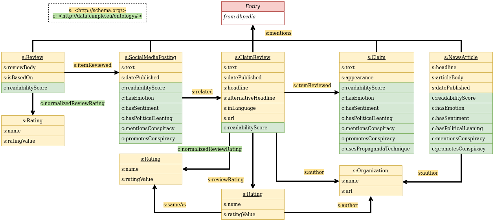

# Cimple KG data model and example SPARQL queries
## Data model



The data model of the Cimple KG is represented in figure [CimpleKG_data_model.png](./CimpleKG_data_model.png).
In yellow are the classes and properties from the [Schema.org](https://schema.org/) vocabulary that we re-use.
In green are the properties that we define in this work. They are used to represent the factors and the normalized ratings. The Cimple ontology is described [here](https://github.com/CIMPLE-project/converter/blob/main/cimple-ontology.ttl)

## Example SPARQL Queries

A SPARQL endpoint is available at [https://data.cimple.eu/sparql](https://data.cimple.eu/sparql). We describe here some queries that can serve as examples or template. They showcase some usecase of Cimple KG.

### [Most mentioned entities](https://data.cimple.eu/sparql?default-graph-uri=&qtxt=PREFIX+schema%3A%3Chttp%3A%2F%2Fschema.org%2F%3E%0D%0ASELECT+%3Fent+COUNT(%3Fdoc)+as+%3Fnum%0D%0AWHERE+{%0D%0A++++%3Fdoc+schema%3Amentions+%3Fent+.%0D%0A}%0D%0AGROUP+BY+(%3Fent)%0D%0AORDER+BY+DESC+(%3Fnum)%0D%0ALIMIT+100&format=text%2Fhtml&should-sponge=&timeout=0&signal_void=on)
```
PREFIX schema:<http://schema.org/>
SELECT ?ent COUNT(?doc) as ?num
WHERE {
    ?doc schema:mentions ?ent .
}
GROUP BY (?ent)
ORDER BY DESC (?num)
LIMIT 100
```

### [Most mentioned entities with Donald Trump](https://data.cimple.eu/sparql?default-graph-uri=&qtxt=PREFIX+schema%3A%3Chttp%3A%2F%2Fschema.org%2F%3E%0D%0APREFIX+dbr%3A%3Chttp%3A%2F%2Fdbpedia.org%2Fresource%2F%3E%0D%0ASELECT+%3Fent+COUNT(distinct+%3Fdoc)+as+%3Fnum%0D%0AWHERE+{%0D%0A++++%3Fdoc+schema%3Amentions+%3Fent+.%0D%0A++++%3Fdoc+schema%3Amentions+dbr%3ADonald_Trump+.%0D%0A++++FILTER+(%3Fent+!%3D+dbr%3ADonald_Trump)%0D%0A}%0D%0AGROUP+BY+(%3Fent)%0D%0AORDER+BY+DESC+(%3Fnum)%0D%0ALIMIT+100&format=text%2Fhtml&should-sponge=&timeout=0&signal_void=on)
```
PREFIX schema:<http://schema.org/>
PREFIX dbr:<http://dbpedia.org/resource/>
SELECT ?ent COUNT(distinct ?doc) as ?num
WHERE {
    ?doc schema:mentions ?ent .
    ?doc schema:mentions dbr:Donald_Trump .
    FILTER (?ent != dbr:Donald_Trump)
}
GROUP BY (?ent)
ORDER BY DESC (?num)
LIMIT 100
```

### [Organisations that published the most fact-checks about Coronoavirus](https://data.cimple.eu/sparql?default-graph-uri=&qtxt=PREFIX+schema%3A%3Chttp%3A%2F%2Fschema.org%2F%3E%0D%0APREFIX+dbr%3A%3Chttp%3A%2F%2Fdbpedia.org%2Fresource%2F%3E%0D%0ASELECT+%3ForgName+%3ForgUrl+COUNT(distinct+%3Fcr)+as+%3Fnum%0D%0AWHERE+{%0D%0A++++%3Fcr+schema%3Aauthor+%3Forg+.%0D%0A++++%3Fcr+schema%3Amentions+dbr%3ACoronavirus+.%0D%0A++++%3Forg+schema%3Aname+%3ForgName+.%0D%0A++++%3Forg+schema%3Aurl+%3ForgUrl+.%0D%0A}%0D%0AGROUP+BY+%3ForgName+%3ForgUrl%0D%0AORDER+BY+DESC+(%3Fnum)%0D%0ALIMIT+100&format=text%2Fhtml&should-sponge=&timeout=0&signal_void=on)
```
PREFIX schema:<http://schema.org/>
PREFIX dbr:<http://dbpedia.org/resource/>
SELECT ?orgName ?orgUrl COUNT(distinct ?cr) as ?num
WHERE {
    ?cr schema:author ?org .
    ?cr schema:mentions dbr:Coronavirus .
    ?org schema:name ?orgName .
    ?org schema:url ?orgUrl .
}
GROUP BY ?orgName ?orgUrl
ORDER BY DESC (?num)
LIMIT 100
```

### [Number of distinct original review labels from fact-checkers that are mapped to a same normalized rating label](https://data.cimple.eu/sparql?default-graph-uri=&qtxt=PREFIX+schema%3A%3Chttp%3A%2F%2Fschema.org%2F%3E%0D%0APREFIX+cimple%3A%3Chttp%3A%2F%2Fdata.cimple.eu%2Fontology%23%3E%0D%0ASELECT+%3FnormalizedRatingLabel+COUNT(distinct+%3Frating)+as+%3Fnum%0D%0AWHERE+{%0D%0A++++%3Fcr+a+schema%3AClaimReview+.%0D%0A++++%3Fcr+schema%3AreviewRating+%3Frating+.%0D%0A++++%3Fcr+cimple%3AnormalizedReviewRating+%3FnormalizedRating+.%0D%0A++++%3FnormalizedRating+schema%3Aname+%3FnormalizedRatingLabel+.%0D%0A%0D%0A}%0D%0AGROUP+BY+(%3FnormalizedRatingLabel)%0D%0AORDER+BY+DESC+(%3Fnum)%0D%0ALIMIT+100&format=text%2Fhtml&should-sponge=&timeout=0&signal_void=on)
```
PREFIX schema:<http://schema.org/>
PREFIX cimple:<http://data.cimple.eu/ontology#>
SELECT ?normalizedRatingLabel COUNT(distinct ?rating) as ?num
WHERE {
    ?cr a schema:ClaimReview .
    ?cr schema:reviewRating ?rating .
    ?cr cimple:normalizedReviewRating ?normalizedRating .
    ?normalizedRating schema:name ?normalizedRatingLabel .

}
GROUP BY (?normalizedRatingLabel)
ORDER BY DESC (?num)
```

### [Dates on which there was the most fact-checks about Ukraine](https://data.cimple.eu/sparql?default-graph-uri=&qtxt=PREFIX+schema%3A%3Chttp%3A%2F%2Fschema.org%2F%3E%0D%0APREFIX+dbr%3A%3Chttp%3A%2F%2Fdbpedia.org%2Fresource%2F%3E%0D%0ASELECT+%3Fdate+COUNT(distinct+%3Fcr)+as+%3Fnum%0D%0AWHERE+{%0D%0A++++%3Fcr+a+schema%3AClaimReview+.%0D%0A++++%3Fcr+schema%3Amentions+dbr%3AUkraine+.%0D%0A++++%3Fcr+schema%3AdatePublished+%3Fdate+.%0D%0A}%0D%0AGROUP+BY+(%3Fdate)%0D%0AORDER+BY+DESC+(%3Fnum)%0D%0ALIMIT+100&format=text%2Fhtml&should-sponge=&timeout=0&signal_void=on)
```
PREFIX schema:<http://schema.org/>
PREFIX dbr:<http://dbpedia.org/resource/>
SELECT ?date COUNT(distinct ?cr) as ?num
WHERE {
    ?cr a schema:ClaimReview .
    ?cr schema:mentions dbr:Ukraine .
    ?cr schema:datePublished ?date .
}
GROUP BY (?date)
ORDER BY DESC (?num)
LIMIT 100
```

### [URL of fact-checks that gave the "not_credible" rating and the misinformation URL they review, from a given date](https://data.cimple.eu/sparql?default-graph-uri=&qtxt=PREFIX+schema%3A+%3Chttp%3A%2F%2Fschema.org%2F%3E%0D%0APREFIX+cimple%3A+%3Chttp%3A%2F%2Fdata.cimple.eu%2Fontology%23%3E%0D%0ASELECT+DISTINCT+%3Ffc_url+%3Fmisinfo_url%0D%0AWHERE+{%0D%0A++++%3Frev+a+schema%3AClaimReview+%3B%0D%0A+++++++++schema%3Aurl+%3Ffc_url+%3B%0D%0A+++++++++schema%3AdatePublished+%3Fdate_published+%3B%0D%0A+++++++++cimple%3AnormalizedReviewRating+%3Frating+%3B%0D%0A+++++++++schema%3AitemReviewed+%3Fclaim+.%0D%0A++++%3Fclaim+a+schema%3AClaim+%3B%0D%0A+++++++++++schema%3Aappearance+%3Fmisinfo_url+.%0D%0A++++%3Frating+schema%3AratingValue+%22not_credible%22+.+%0D%0A++++FILTER+(%3Fdate_published+%3E%3D+xsd%3Adate(%222024-04-10%22))+.%0D%0A}%0D%0AORDER+BY+DESC(%3Fdate_published)%0D%0ALIMIT+100&format=text%2Fhtml&should-sponge=&timeout=0&signal_void=on)
```
PREFIX schema: <http://schema.org/>
PREFIX cimple: <http://data.cimple.eu/ontology#>
SELECT DISTINCT ?fc_url ?misinfo_url
WHERE {
    ?rev a schema:ClaimReview ;
         schema:url ?fc_url ;
         schema:datePublished ?date_published ;
         cimple:normalizedReviewRating ?rating ;
         schema:itemReviewed ?claim .
    ?claim a schema:Claim ;
           schema:appearance ?misinfo_url .
    ?rating schema:ratingValue "not_credible" . 
    FILTER (?date_published >= xsd:date("2024-04-10")) .
}
ORDER BY DESC(?date_published)
LIMIT 100
```
