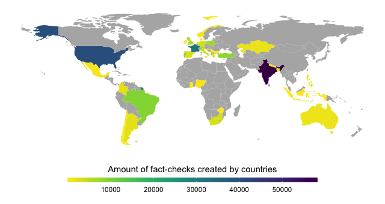

# 📚 CIMPLE Knowledge Graph (CimpleKG)

[![CC BY-NC-SA 4.0][cc-by-nc-sa-shield]][cc-by-nc-sa]

[![CC BY-NC-SA 4.0][cc-by-nc-sa-image]][cc-by-nc-sa]

[cc-by-nc-sa]: http://creativecommons.org/licenses/by-nc-sa/4.0/
[cc-by-nc-sa-image]: https://licensebuttons.net/l/by-nc-sa/4.0/88x31.png
[cc-by-nc-sa-shield]: https://img.shields.io/badge/License-CC%20BY--NC--SA%204.0-lightgrey.svg

> The CIMPLE Knowledge Graph (CimpleKG) is a continuously updated large knowledge graph that has been created to help researchers combat misinformation. CimpleKG links information from fact-checking organizations with other datasets about misinformation, giving researchers a more comprehensive view of the problem.
>
> This repository contains scripts to deploy the Knowledge Graph developed within the [CIMPLE project](https://www.chistera.eu/projects/cimple).



The data being loaded is available at https://github.com/CIMPLE-project/knowledge-base/releases and is updated on a daily (nightly) basis.

The source code to retrieve the body of the claim review from the specified url is available in the [claimreview-text-extractor repository](https://github.com/CIMPLE-project/claimreview-text-extractor).

We fully document the [URI design pattern](https://github.com/CIMPLE-project/converter/blob/main/URI-patterns.md) that are used to identify all objects in the knowledge graph.

The code that converts the daily updated Claim Reviews into RDF is available in the [converter repository](https://github.com/CIMPLE-project/converter).

The Claim Reviews data integrated in the CimpleKG is available on the [claimreview-data repository](https://github.com/MartinoMensio/claimreview-data).

## 🔍 Knowledge Graph Overview and Documentation

CimpleKG links daily updated data from 70+ fact-checking organisations with over 200k documents from static misinformation datasets. The knowledge graph is augmented with textual features and entities extracted from the textual data integrated into the graph. The knowledge graph contains more than 15m triples, including 263k+ distinct entities and 1m textual features with over 203k fact-checked claims, spanning 26 languages and 36 countries. Detailed statistics can be found on the [releases page](https://github.com/CIMPLE-project/knowledge-base/releases).

A public SPARQL endpoint is available at https://data.cimple.eu/sparql and data releases are made available in this repository. The knowledge graph can be also loaded and queried locally (see _Initialising the Knowledge Graph_).

SPARQL Query examples and additional documentation can be found in the [documentation page](./Documentation.md).

### RDF Namespaces

CimpleKG commonly uses the following namespaces and prefixes:

| Prefix | URI                                           |
| ------ | --------------------------------------------- |
| dc     | <http://purl.org/dc/elements/1.1/>            |
| rdf    | <http://www.w3.org/1999/02/22-rdf-syntax-ns#> |
| rnews  | <http://iptc.org/std/rNews/2011-10-07#>       |
| schema | <http://schema.org/>                          |
| xsd    | <http://www.w3.org/2001/XMLSchema#>           |

They can be imported into Virtuoso through the isql interface:

```sql
DB.DBA.XML_SET_NS_DECL ('dc', 'http://purl.org/dc/elements/1.1/', 2);
DB.DBA.XML_SET_NS_DECL ('rdf', 'http://www.w3.org/1999/02/22-rdf-syntax-ns#', 2);
DB.DBA.XML_SET_NS_DECL ('rnews', 'http://iptc.org/std/rNews/2011-10-07#', 2);
DB.DBA.XML_SET_NS_DECL ('schema', 'http://schema.org/', 2);
DB.DBA.XML_SET_NS_DECL ('xsd', 'http://www.w3.org/2001/XMLSchema#', 2);
```

## 🚧 Initialising the Knowledge Graph

This section covers the steps required to set up a new Knowledge Base for the first time.

1. Clone this repository.

   ```bash
   git clone https://github.com/CIMPLE-project/knowledge-base.git
   cd knowledge-base
   ```

1. Copy the `.env.example` file to `.env` and edit it to set the environment variables accordingly.

   - `DBA_PASSWORD`: Password for the Virtuoso database.
   - `SPARQL_UPDATE`: Enable SPARQL update queries.
   - `VIRT_SPARQL_ResultSetMaxRows`: Maximum number of rows to return in a SPARQL query.
   - `VIRT_SPARQL_MaxQueryCostEstimationTime`: Maximum time to estimate the cost of a SPARQL query.
   - `VIRT_SPARQL_MaxQueryExecutionTime`: Maximum time to execute a SPARQL query.
   - `VIRTUOSO_DATA_PATH`: Path to the Virtuoso data directory.
   - `VIRTUOSO_PORT`: Port to expose the Virtuoso database.
   - `WHD_HOOK_TIMEOUT`: Timeout for the webhook server.
   - `GITHUB_TOKEN`: GitHub token to create the [releases](https://github.com/CIMPLE-project/knowledge-base/releases).
   - `CIMPLE_FACTORS_MODELS_PATH`: Path to the CIMPLE factors models.

1. Run docker compose to start the Virtuoso database and the webhook server.

   ```bash
   docker compose up -d
   ```

1. Generate a password for the webhook server and restart the service.

   This step is optional but recommended if you plan to expose the webhook server to the internet.

   ```bash
   docker compose exec webhookd htpasswd -B -c /etc/webhookd/.htpasswd api
   docker compose restart webhookd
   ```

### Loading data into the Knowledge base

1. Copy all your RDF files into a `dumps` folder inside the data directory (defined by `VIRTUOSO_DATA_PATH` in the `.env` file).

   Directory structure example (in this case `VIRTUOSO_DATA_PATH` is set to `/var/docker/cimple/virtuoso/data`):

   - `/var/docker/cimple/virtuoso/data/dumps/`
     - `iptc/*.ttl`
     - `agencefrancepresse/*.ttl`

1. Run the following command to load all dumps:

   The script [deploy_all.sh](scripts/deploy_all.sh) will initialize the prefixes, and load all the vocabularies, IPTC codes, and RDF dumps.

   ```bash
   docker compose exec virtuoso sh /scripts/deploy_all.sh
   ```

### Manually loading a specific file

You can also load certain files given a pattern using the [load.sh](scripts/load.sh) script.

(Note: make sure that the files you wish to load have been copied to the `dumps` folder inside the Virtuoso data directory).

For example, the following command will load all dumps contained in the folder "agencefrancepresse", starting with "2020\_", and ending with ".ttl":

```bash
docker compose exec virtuoso sh /scripts/load.sh -p5 -g "http://data.cimple.eu/agencefrancepresse/news" "agencefrancepresse" "2020_*.ttl"
```

To load all files from the folder "agencefrancepresse/FRA":

```bash
docker compose exec virtuoso sh /scripts/load.sh -p5 -g "http://data.cimple.eu/agencefrancepresse/news" "agencefrancepresse/FRA" "*.*"
```

Syntax: `load.sh [options] [graph] [dir path] [file mask]]`

List of parameters:

```
-h --help       Show help
-p --parallel   Number of parallel threads for loading RDF data (through rdf_loader_run())
-g --graph      Name of graph to load the data into
-c --clear      Clear graph before loading
```

### Webhook server

The webhook server is used to trigger the deployment of the RDF data.

_Webhooks list:_

- http://localhost:8880/redeploy - Executes the deployment script.
- http://localhost:8880/status - Returns "OK" if the service is running.

_Example:_

```bash
curl -u api:$API_PASSWORD http://localhost:8880/status
curl -u api:$API_PASSWORD -XPOST http://localhost:8880/redeploy?url=https%3A%2F%2Fgithub.com%2FMartinoMensio%2Fclaimreview-data%2Freleases%2Ftag%2F2023_08_22
```

(replace `$API_PASSWORD` with the password you generated during Setup step)

### Dereferencing

The list of path to be dereferenced is in `dereferencing/config.yml`. See the full list of [URI patterns](URI.patterns.md) for reference.

For exporting the apache config and the script for adding them to Virtuoso, run:

```bash
cd dereferencing
npx list2dereference config.yml
docker compose cp insert_vhost.sql virtuoso:/insert_vhost.sql
docker compose exec -i virtuoso sh -c "isql-v -U dba -P \${DBA_PASSWORD} < /insert_vhost.sql"
```

Read more at https://github.com/pasqLisena/list2dereference

### URL Shortening

The service can be accessed at http://cimple.eurecom.fr/c/.

To install the URL shortening service, run the following commands:

```bash
docker compose cp scripts/c_uri_dav.vad virtuoso:/usr/local/virtuoso-opensource/share/virtuoso/vad/c_uri_dav.vad
docker compose exec -i virtuoso sh -c "isql-v -U dba -P \${DBA_PASSWORD} exec=\"DB.DBA.VAD_INSTALL('/usr/local/virtuoso-opensource/share/virtuoso/vad/c_uri_dav.vad');\""
```

The service is hosted on the route `/c`. You may have to update the apache2 Virtual Host configuration to map the route, for example (assuming Virtuoso is hosted on port 8890):

```apacheconf
<Location /c>
    ProxyPreserveHost On
    ProxyPass http://localhost:8890/c
    ProxyPassReverse http://localhost:8890/c
</Location>
```
