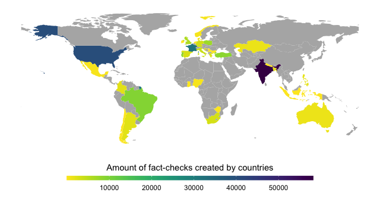

# 📚 CIMPLE Knowledge Graph (CimpleKG)

[![CC BY-NC-SA 4.0][cc-by-nc-sa-shield]][cc-by-nc-sa]

[![CC BY-NC-SA 4.0][cc-by-nc-sa-image]][cc-by-nc-sa]

[cc-by-nc-sa]: http://creativecommons.org/licenses/by-nc-sa/4.0/
[cc-by-nc-sa-image]: https://licensebuttons.net/l/by-nc-sa/4.0/88x31.png
[cc-by-nc-sa-shield]: https://img.shields.io/badge/License-CC%20BY--NC--SA%204.0-lightgrey.svg

> The CIMPLE Knowledge Graph (CimpleKG) is a continuously updated large knowledge graph that has been created to help researchers combat misinformation. CimpleKG links information from fact-checking organizations with other datasets about misinformation, giving researchers a more comprehensive view of the problem.
>
> This repository contains scripts to deploy the Knowledge Graph developed within the [CIMPLE project](https://www.chistera.eu/projects/cimple).



The data being loaded is available at https://github.com/CIMPLE-project/knowledge-base/releases and is updated on a daily (nightly) basis.

The source code to retrieve the body of the claim review from the specified url is available in the [claimreview-text-extractor repository](https://github.com/CIMPLE-project/claimreview-text-extractor).

We fully document the [URI design pattern](https://github.com/CIMPLE-project/converter/blob/main/URI-patterns.md) that are used to identify all objects in the knowledge graph.

The code that converts the daily updated Claim Reviews into RDF is available in the [converter repository](https://github.com/CIMPLE-project/converter).

The Claim Reviews data integrated in the CimpleKG is available on the [claimreview-data repository](https://github.com/MartinoMensio/claimreview-data).

## 🔍 Knowledge Graph Overview and Documentation

CimpleKG links daily updated data from 70+ fact-checking organisations with over 200k documents from static misinformation datasets. The knowledge graph is augmented with textual features and entities extracted from the textual data integrated into the graph. The knowledge graph contains more than 15m triples, including 263k+ distinct entities and 1m textual features with over 203k fact-checked claims, spanning 26 languages and 36 countries. Detailed statistics can be found on the [releases page](https://github.com/CIMPLE-project/knowledge-base/releases).

A public SPARQL endpoint is available at https://data.cimple.eu/sparql and data releases are made available in this repository. The knowledge graph can be also loaded and queried locally (see _Initialising the Knowledge Graph_).

SPARQL Query examples and additional documentation can be found in the [documentation page](./Documentation.md).

### RDF Namespaces

CimpleKG commonly uses the following namespaces and prefixes:

| Prefix | URI                                           |
| ------ | --------------------------------------------- |
| dc     | <http://purl.org/dc/elements/1.1/>            |
| rdf    | <http://www.w3.org/1999/02/22-rdf-syntax-ns#> |
| rnews  | <http://iptc.org/std/rNews/2011-10-07#>       |
| schema | <http://schema.org/>                          |
| xsd    | <http://www.w3.org/2001/XMLSchema#>           |

## 🚧 Initialising the Knowledge Graph

This section covers the steps required to set up a new Knowledge Base for the first time.

1. Clone this repository.

   ```bash
   git clone https://github.com/CIMPLE-project/knowledge-base.git
   cd knowledge-base
   ```

1. Copy the `.env.example` file to `.env` and edit it to set the environment variables accordingly.

   - `QLEVER_ACCESS_TOKEN`: Access token for QLever update operations (at least 32 characters).
   - `QLEVER_UID` / `QLEVER_GID`: UID/GID the QLever processes run as (defaults to 999).
   - `QLEVER_INDEX_MEMORY`: Memory for the index build (default 2G).
   - `QLEVER_MEMORY_FOR_QUERIES`: Memory for query processing (default 4G).
   - `QLEVER_CACHE_MAX_SIZE`: Query cache size (default 2G).
   - `QLEVER_QUERY_TIMEOUT`: Query timeout (default 120s).
   - `WORKBENCH_ADMIN_USER` / `WORKBENCH_ADMIN_PASSWORD`: Admin account of the RDF Workbench UI.
   - `WORKBENCH_URL`: Externally visible URL of the workbench (default https://data.cimple.eu).
   - `SPARQL_TIMEOUT_MS`: Workbench-side SPARQL timeout (default 120000).
   - `WHD_HOOK_TIMEOUT`: Timeout for the webhook server.
   - `GITHUB_TOKEN`: GitHub token to create the [releases](https://github.com/CIMPLE-project/knowledge-base/releases).
   - `CIMPLE_FACTORS_MODELS_PATH`: Path to the CIMPLE factors models.

1. Run docker compose to start QLever, the RDF Workbench and the webhook server.

   ```bash
   docker compose up -d
   ```

1. Build the first index. Copy RDF dumps into `qlever/dumps/` (see _Rebuilding the index_ below), then run:

   ```bash
   bash qlever/deploy-and-archive.sh
   ```

1. Configure the dereferenceable resource paths in the RDF Workbench admin UI (`claim-review`, `review`, `tweet`, `news-article`, `organization`, `rating`, `claim`, `entity`, `emotion`, `conspiracy`, `meme`, `political-leaning`, `sentiment`, `original_rating`). See _Dereferencing_ below.

### Rebuilding the index

The QLever index is rebuilt from the RDF dumps in `qlever/dumps/`. The directory structure is:

- `qlever/dumps/graph/<source>/*.ttl`: loaded into named graph `http://data.cimple.eu/graph/<source>`
- `qlever/dumps/graph/claimreview/claim-review.nt`: the cumulative ClaimReview conversion, refreshed daily from the webhookd cache and deduplicated
- `qlever/dumps/ontology/*.ttl`: loaded into named graph `http://data.cimple.eu/ontology`
- `qlever/dumps/vocabulary/*.ttl`: loaded into named graph `http://data.cimple.eu/vocabulary`
- `qlever/dumps/dbpedia-per-entity.nq`: one-time export of the per-entity DBpedia graphs

The rebuild script refreshes the claimreview file from the webhookd cache, archives the dumps to the public URL, builds a candidate index, swaps it in, verifies the triple counts, and only then pings healthchecks. To rebuild:

```bash
bash qlever/deploy-and-archive.sh
```

### Webhook server

The webhook server is used to trigger the deployment of the RDF data.

_Webhooks list:_

- http://localhost:8880/redeploy - Executes the deployment script.
- http://localhost:8880/status - Returns "OK" if the service is running.

_Example:_

```bash
curl -u api:$API_PASSWORD http://localhost:8880/status
curl -u api:$API_PASSWORD -XPOST http://localhost:8880/redeploy?url=https%3A%2F%2Fgithub.com%2FMartinoMensio%2Fclaimreview-data%2Freleases%2Ftag%2F2023_08_22
```

(replace `$API_PASSWORD` with the password you generated during Setup step)

### Dereferencing

The RDF Workbench serves URI dereferencing as HTML resource pages. The list of dereferenceable path segments is configured in the workbench admin UI. The configured segments:

`claim-review`, `review`, `tweet`, `news-article`, `organization`, `rating`, `claim`, `entity`, `emotion`, `conspiracy`, `meme`, `political-leaning`, `sentiment`, `original_rating`

See the full list of [URI patterns](URI.patterns.md) for reference. RDF access to the data remains at the [SPARQL endpoint](https://data.cimple.eu/sparql).
